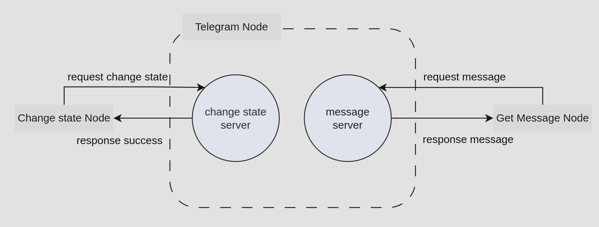

# TELEGRAM ROS: Real-Time Communication with Telegram for ROS

## Overview
This is a package that allows ROS to communicate with Telegram. Nodes are divided into two states: those that can receive messages and those that cannot. If a node is in the available state, other nodes can receive messages through service calls.

## 1. Node
This package only provides a single `telegram_ros` Node. A detailed description of this Node and its configuration options is found below.
### 1.1 telegram_ros
 

#### 1.1.1 Services
`change_state_service` ([geometry_msgs/Twist](https://docs.ros.org/en/api/geometry_msgs/html/msg/Twist.html))

This is the service you use to change the state of Telegram. For example, when you don't want to receive Telegram commands, or when you want to receive Telegram commands. 

`request_message_service` ([geometry_msgs/Twist](https://docs.ros.org/en/api/geometry_msgs/html/msg/Twist.html))

This is a service that checks for messages from Telegram and sends responses to requests. If there is a message, it sends True and a text message, otherwise it sends False and a blank message. 


## Requirements
For building and running the application you need:
- [ros](http://wiki.ros.org/noetic/Installation/Ubuntu) (version: neotic)
- [python](https://www.python.org/downloads/release/python-3810/) (version: 3.8.10)
  
## Installation
After the installation is complete, you need to get a token and chat_id from Telegram.

```bash
$ pip install python-telegram-bot --upgrade
```

## Building
This is a simple build process.

```bash
$ cd catkin_workspace/src
$ git clone https://github.com/wntdev99/flexbe_telegram_app
$ cd ..;catkin_make
```

## How to use
The example below shows how to run a node using the `rosrun` command.
```bash
$ rosrun telegram_ros telegram_node
```

The example below shows how to launch a node using the `roslaunch` command.
```bash
$ roslaunch telegram_ros telegram_ros.launch
```

## Citing
python-telegram-bot:
[https://docs.python-telegram-bot.org/en/v21.0.1/](https://docs.python-telegram-bot.org/en/v21.0.1/)

rospy-service:
[http://wiki.ros.org/rospy/Overview/Services](http://wiki.ros.org/rospy/Overview/Services)


